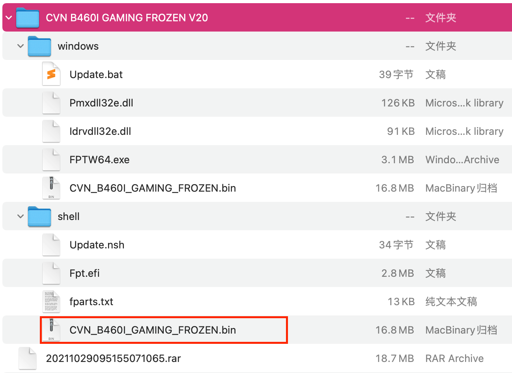
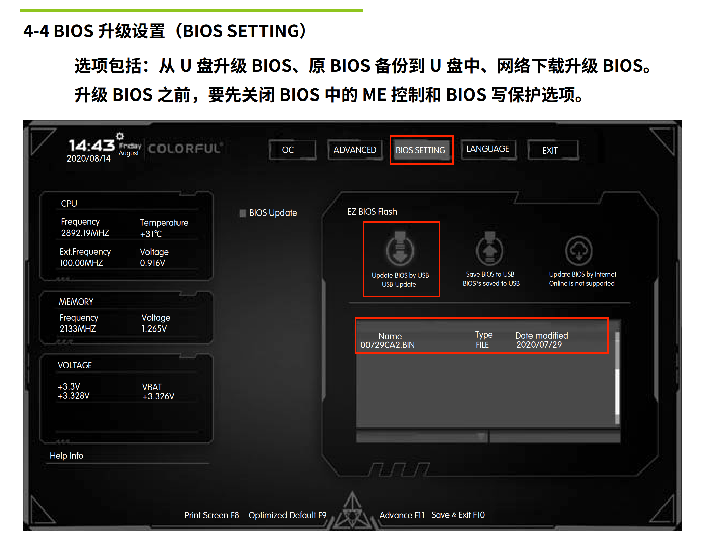

# hackintosh-colorful-b460i

> 七彩虹 B460I CVN Forzen + Intel-i5-10400 + AMD Radeon RX560 黑苹果 EFI 制作分享

## 引导方式

> 采用 [OpenCore](https://github.com/acidanthera/OpenCorePkg) 方式引导，版本为 `0.7.5 RELEASE`

## 镜像

> macOS 镜像根据个人喜好获取或制作，建议选择的 macOS 镜像系统在 Bigsur 11.2.3 及以下，方便后续定制 USB 端口操作

1. 国内大佬[黑果小兵的部落阁](https://blog.daliansky.net/)获取(最新的镜像是关注小兵的微信公众号通过打赏获得分享链接下载)

   > 小兵的镜像附带 WinPE, OpenCore, Clover 三分区引导的，在调试时更方便，个人比较推荐

2. 通过 macOS 上的 App Store 制作

   > 好处是纯净，通过自己的能力制作，更容易获得成就感(更好地装13)，细致教程可以参考 [tonymacx86](https://www.tonymacx86.com/threads/unibeast-install-macos-catalina-on-any-supported-intel-based-pc.285366/#download) 的这篇以 `macOS Catalina` 为例的文章自行尝试

## U 盘刻录

**需要注意的点**

1. 16GB 及以上的容量(镜像+分区空间都在 12GB 左右)
2. 非杂牌 U 盘(用的黑片回收颗粒，读写速度堪忧，镜像刻录和安装系统时得等个半天)，最好大品牌
3. 使用 [balenaEtcher](https://www.balena.io/etcher/) 刻录镜像到 U 盘，好处是开源，macOS, Windows, Linux 系统通用

## B460I BIOS 升级(可选)

> 最新版的 `BIOS` 支持更多选项 

1. 前往 [七彩虹B460I 官网主板技术支持](http://colorful.cn/product_show.aspx?mid=84&id=833)，下载最新的 `BIOS` 文件

   

  2.   下载完成后得到一个 `zip` 文件，解压后得到如下图所示文件:

       

3. 将上一步中解压得到的文件夹放入 `FAT32` 格式的 U 盘中，然后重启进入 `BIOS`，关闭 `BIOS` 中的 `Advanced` -> `PCH Configuration` -> `ME Control` 和 `Boot` -> `BIOS Write Protect` 为下一步更新 `BIOS` 做准备，`F10` 保存重新进入 `BIOS`

4. 找到以下界面中描述的选项，`BIOS` 文件选择 U 盘中的 `bin` 文件，点击 update 升级，升级前确保机器不会被断电：

   

4. 升级完成会自动重启，重新进入 `BIOS` 检查 `BIOS` 的版本是否已经更改为最新的

## `BIOS` 调节选项

**OC 推荐关闭项**

> 某些选项 B460I 主板没有，可能后续升级的 `BIOS` 中有，统一列出说明

1. Fast Boot: 快速启动

   - B460I 没有此项

2. Secure Boot: 安全启动

   - Advanced -> Boot -> Secure Boot

3. Serial/COM Port: 串行端口

   - B460I 没有此项

4. Parallel Port: 并行端口

   - B460I 没有此项

5. VT-d: 虚拟化设置(Intel Virtual Technology)

   > 个人感觉不影响安装，有虚拟化的需求的要打开

   - Advanced -> Advanced -> CPU Configuration -> Intel(VMX) Virtualization Technology 

6. CSM: 兼容性支持模块(Compatibility Support Module)

   - Advanced -> Advanced -> CSM Configuration -> Disabled

7. Thunderbolt: 雷电口

   - B460I 没有此项

8. Intel SGX: Intel 安全容器技术

   - B460I 没有此项

9. Intel Platform Trust: PTT

   > 如果需要安装 Windows11 系统需要开启

10. CFG Lock: CFG 锁

    - OC -> CFG Lock -> Disabled
