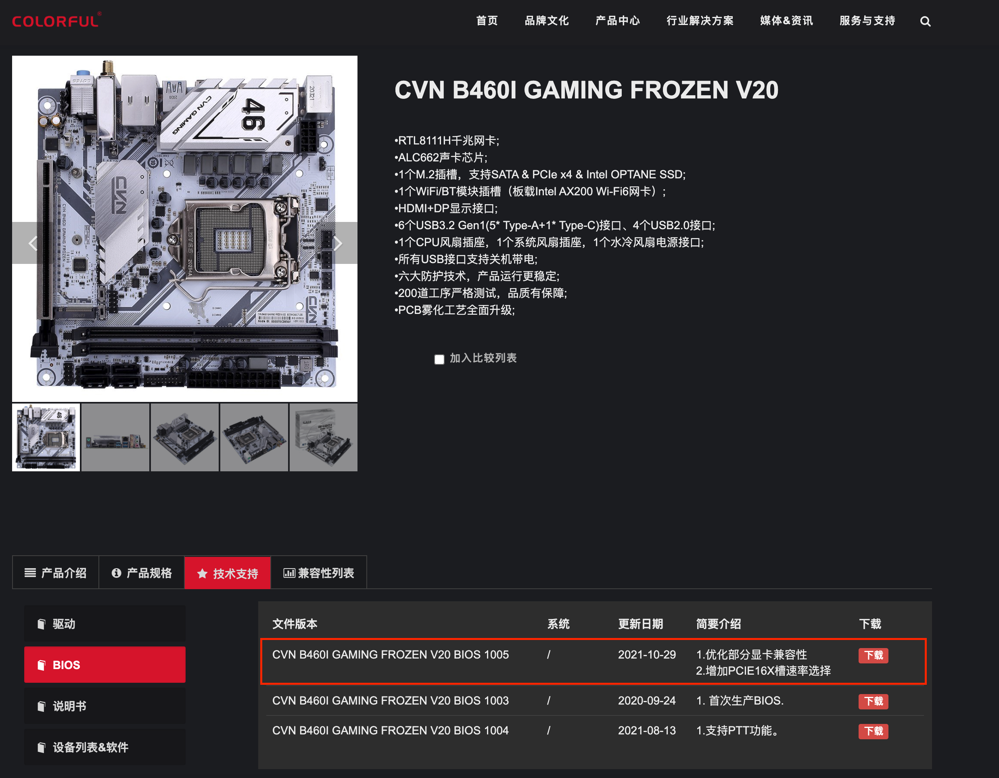

# hackintosh-colorful-b460i

> 七彩虹 B460I CVN Forzen + Intel-i5-10400 + AMD Radeon RX560 黑苹果 EFI 分享

## 引导方式

> 采用 [OpenCore](https://github.com/acidanthera/OpenCorePkg) 方式引导

1. `OpenCore` 引导方式更成熟
2. `OpenCore` 引导方式官方文档更齐全
3. `OpenCore` 引导配置工具更人性化(简单)

## 镜像

> macOS 镜像根据个人喜好获取或制作

1. 国内大佬[黑果小兵的部落阁](https://blog.daliansky.net/)获取(最新的镜像是关注小兵的微信公众号通过打赏获得分享链接下载)

   > 小兵的镜像附带 WinPE, OpenCore, Clover 三分区引导的，在调试时更方便，个人比较推荐

2. 通过 macOS 上的 App Store 制作

   > 好处是纯净，通过自己的能力制作，更容易获得成就感(更好地装13)，细致教程可以参考 [tonymacx86](https://www.tonymacx86.com/threads/unibeast-install-macos-catalina-on-any-supported-intel-based-pc.285366/#download) 的这篇以 `macOS Catalina` 为例的文章自行尝试

## U 盘刻录

**需要注意的点**

1. 16GB 及以上的容量(镜像+分区空间都在 12GB 左右)
2. 非杂牌 U 盘(用的黑片回收颗粒，读写速度堪忧，镜像刻录和安装系统时得等个半天)，最好大品牌
3. 使用 [balenaEtcher](https://www.balena.io/etcher/) 刻录镜像到 U 盘，好处是开源，macOS, Windows, Linux 系统通用

## B460I BIOS 升级(可选)

1. 前往 [七彩虹B460I 官网主板技术支持](http://colorful.cn/product_show.aspx?mid=84&id=833)，下载最新的 `BIOS` 文件

   
